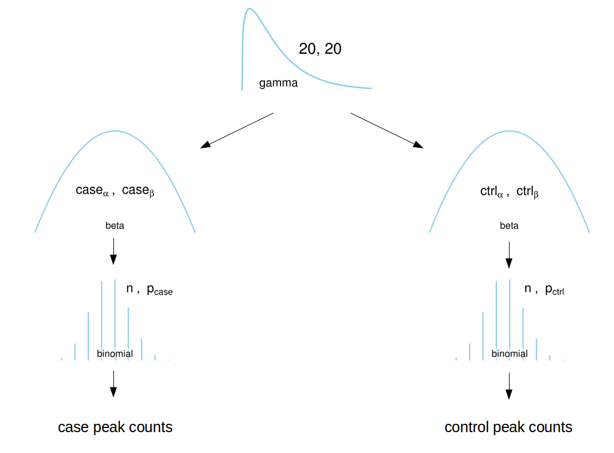

# bmarkdiff
Bayesian modelling of chipseq peaks

## Problem  

Running ChromHMM on tumor and normal samples, we get tens of thousands of genomic regions with identifiable marks. However, the number of samples in the cases and controls is much much smaller than the number of regions. So if we consider each region independently, there is not enough statistical power to identify regions that are differentially marked. 

## Motivation  

We noticed that there's a global correlation of counts in the two groups. We want this to serve as a background empirical prior. This provides estimate shrinkage, reducing the rate of false positives.

## Model



## Usage

```{r}
estimate_joint_prior(input = '/path/to/CombinedMatrix-E1-10000bps.txt', n_case = 12, n_iter = 3834, use_vb = FALSE, use_subsamp = TRUE, n_subsamp = 1000, n_cores = 3, n_chains = 3, n_warmup = 500, hdi_content = .99)
```

This randomly samples 1000 regions from the mark file, then uses Stan's default MCMC sampler to to estimate the background prior on the four beta prior parameters. It outputs a list containing three objects:  

* The estimated joint prior  
* An "outcome data-frame" listing all possible combinations of outcomes from the input sample sizes and whether or not they are called as differentially marked by the input HDI.
* A data frame listing all regions whose outcomes are called as differentially marked by the given HDI.
